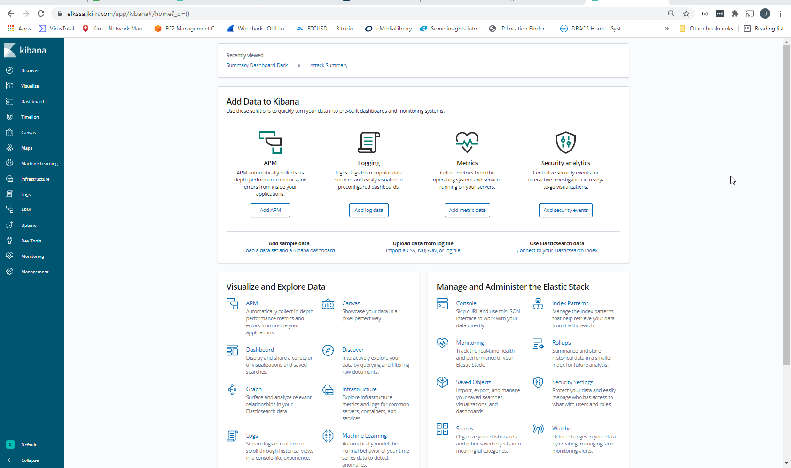
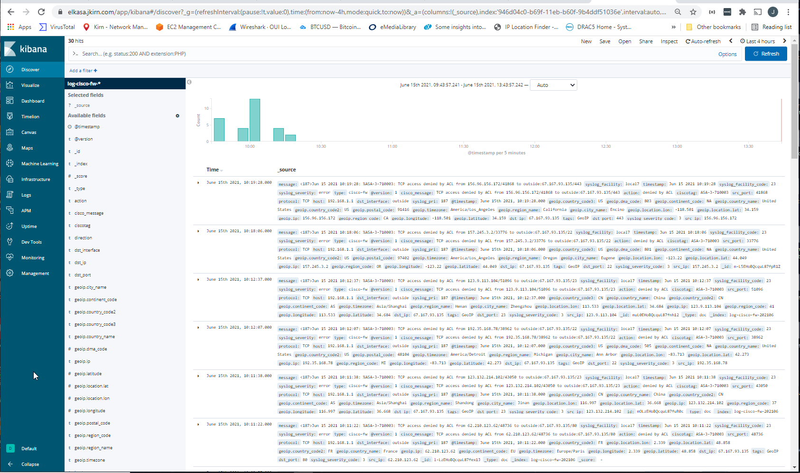
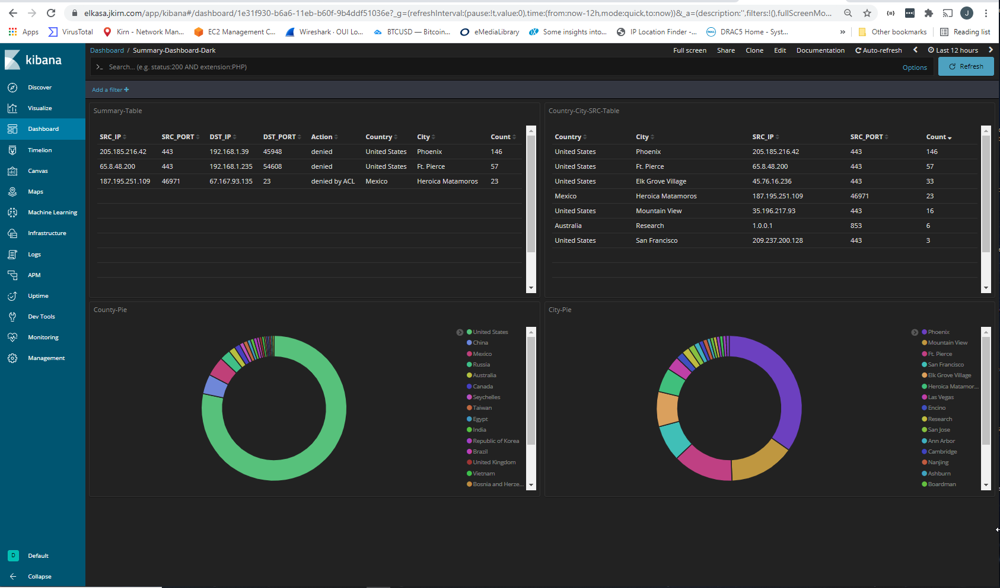

# Install Elasticsearch for Cisco ASA messages on Ubuntu 18.04 

> This repository lists steps to create your own Elasticsearch web application that collects Cisco ASA (5504 in my case) syslog messages.

## What is Elasticsearch
Elasticsearch combines Elasticsearch, Logstash, and Kibana into a powerful open source stack that lets you manage large amounts of logged data from a convenient graphical web interface. All three applications are developed be [Elastic](https://www.elastic.co/). They are designed to work in tandem and they are relatively easy to get them setup on your Ubuntu system.

The below steps are designed to help you create your own Elasticsearch application designed to collect and search syslog messages from Cisco ASAs. The application uses Ubuntu 18.04 desktop as the latest version 20.04 is not compatible with now discontinued GeoLiteCity.dat database. [Maxmind](https://www.maxmind.com/en/home) no longer supports the GeoLiteCity.dat format. Maxmind has switched to a GeoLite2 version that uses a different format and it wasn't obvious how to get compatibility to the new format for this application. A copy of the last available GeoLiteCity.dat file is in this repository, but it is several years old. It is useful as-is to identify cities and countries of origin.

> **Note:**
>
> The following steps are based on article ["Install ELK on Ubuntu 18.04 Bionic Beaver Linux"](https://linuxconfig.org/install-elk-on-ubuntu-18-04-bionic-beaver-linux ).

## Prerequsites
- Ubuntu 18.04 Desktop

## Install Ubuntu 18.04 LTS
- [Download ISO](#Download ISO).
- [Create VM](#Create VM)
- [Setup Static IP](#Setup Static IP).
- [Install Dependencies](#Install Dependencies).
- [Add the Elastic Repository](#Add the Elastic Repository).
- [Install Elasticsearch and Kibana](#Install Elasticsearch and Kibana).
- [Setup NGINX](#Setup NGINX)
- [Install Logstash](#Install Logstash)
- [Sign in to Kibana](#Sign in to Kibana)

### Download ISO
**Step 1:** The Ubuntu 18.04 LTS ISO can downloaded at this [link](https://releases.ubuntu.com/18.04/).

### Create VM
**Step 2:** I will be creating a VM in my VMware vSphere Cluster. The VM consisted of the following settings:
- 2 vCPUs
- 8 GB RAM
- 60 GB vDisk (or larger)
- VM installed on same network as Cisco ASA

Use the downloaded ISO from Step 1 to create the VM. Then open a terminal window and do an update and upgrade:
```console
sudo apt update
sudo apt upgrade
```
### Setup Static IP
**Step 3:** To configure a static IP address on your Ubuntu 18.04 VM you need to modify a relevant netplan network configuration file within /etc/netplan/ directory. In my case the file's name is 01-network-manager-all.yaml. See below for the contents of this file:

```console
# This file describes the network interfaces available on your system
# For more information, see netplan(5).
network:
  version: 2
  renderer: networkd
  ethernets:
    ens160:
     dhcp4: no
     addresses: [192.168.1.178/24]
     gateway4: 192.168.1.1
     nameservers:
       addresses: [192.168.1.248,192.168.1.249]
```
> **Note:** You will need to modify/create this file to match the settings needed for your system.

Once you are satisfied with the contents of this file you can apply the settings to your system by executing the following:
```console
sudo netplan apply
```
In case you run into issues with netplan you can get further information by running:
```console
sudo netplan --debug apply
```

### Install Dependencies
**Step 4:** Begin by installing the dependencies. These are all fairly common, though there are a couple of notes that you need to take into account. Of course, these are Nginx-based, so disable Apache or switch the port, if you're using it. 

Logstash doesn't support Java 10 (or higher), which is installed on Ubuntu 18.04 by default. If you have it installed on your system, remove it. Use the older version until Logstash gets support. After you remove Java 10, you can install the older Java 8 by executing the below command:
```console
sudo apt install openjdk-8-jre apt-transport-https wget
```

> **Note:** The above step also installs wget and apt-transport-https which will be used in later steps.

### Add the Elastic Repository
**Step 5:** Elastic provides a complete repository for Debian based systems that includes all three pieces of software. You just need to add it to your system. Begin by importing their GPG key. 
```console
$ wget -qO - https://artifacts.elastic.co/GPG-KEY-elasticsearch | sudo apt-key add -
```
Next, add the repository. Create a file at /etc/apt/sources.list.d/elastic.list, and paste the following line into it. 
```console
deb https://artifacts.elastic.co/packages/6.x/apt stable main
```

Save that file, and exit. Update Apt. 
```console
sudo apt update
```

### Install Elasticsearch and Kibana
**Step 6:** You're now ready to install Elasticsearch and Kibana. They're available through Apt, so get them like you normally would. 
```console
sudo apt install elasticsearch kibana
```

You need to edit the Kibana configuration file at /etc/kibana/kibana.yml to tell it that the host server is localhost. The line is already there. Uncomment it. 
```console
server.host: "localhost"
```

Restart Kibana and start up Elasticsearch, and both will be ready to go.
```console
sudo systemctl restart kibana
sudo systemctl start elasticsearch
```
You should also make sure that they both run after a restart. Execute the following to enable them:
```console
sudo systemctl enable kibana
sudo systemctl enable elasticsearch
```
### Install Logstash
**Step 7:** Now you need to install Logstash. Just install it with the Apt package manager. 

```console
sudo apt install logstash
```
You need to configure logstash through a configuration file logstasth.conf Download the **logstash.conf** file in this repository and install it at /etc/logstash/conf.d/
```console
sudo cp logstash.conf /etc/logstash/cond.d/
```

Run the following to make sure logstash starts:
```console
sudo systemctl restart logstash
```

Also run the following to make sure logstash runs after a restart:
```console
sudo systemctl enable logstash
```

## Get CA Signed Server certificate info for SSL install
**Step 8:** Follow the steps documented at my github repository [Private-Certificate-Authority](https://github.com/jjkirn/Private-Certificate-Authority) to create your own CA and generate the target server certificate files for this server:
 - elkasa.crt
 - elkasa.key

That same document explains how to transfer these files from the CA server to this target (sysmon) server.

The above target sever ca files should be moved to a safe location which will be referenced in the Nginx configuration file:
```console
sudo mkdir /opt/mycerts
sudo cp elkasa.* /opt/mycerts/
```

### Setup NGINX
**Step 9:** Kibana is served through Nginx, so you need to set up a Nginx configuration to get it to serve your instance of Kibana. Start by creating a password for Kibana. This way, your server isn't accessible openly. Use OpenSSL to generate the password, and place it in /etc/nginx/htpasswd.kibana. You can change the username to anything you want. In this instance, it's admin.

```console
$ echo "admin:`openssl passwd -apr1 yourPassword`" | sudo tee -a /etc/nginx/htpasswd.kibana
```

**Step 10:** After you have your created your password, create an Nginx configuration file **kibana** at /etc/nginx/sites-available. Make sure to use your actual server url or IP.
```console
server {
        listen 80;
        server_name elkasa.jkirn.com;
        return 301 https://$host$request_uri;

        location / {
        # 
        }
}

server {
        listen                  443 ssl;
        server_name             elkasa.jkirn.com;
        ssl_certificate         /opt/mycerts/elkasa.crt;
        ssl_certificate_key     /opt/mycerts/elkasa.key;
        ssl_protocols           TLSv1 TLSv1.1 TLSv1.2;
        ssl_ciphers             HIGH:!aNULL:!MD5;

        auth_basic              "Restricted Access";
        auth_basic_user_file    /etc/nginx/htpasswd.kibana;

        location / {
                proxy_set_header        Host $host;
                proxy_set_header        X-Real-IP $remote_addr;
                proxy_set_header        X-Forwarded-For $proxy_add_x_forwarded_for;
                proxy_pass              http://localhost:5601;
        }
}
```

After you have your configuration, remove the existing default config, and create a new symlink in sites-enabled for Kibana:
```console
sudo rm /etc/nginx/sites-enabled/default
sudo ln -s /etc/nginx/sites-available/kibana /etc/nginx/sites-enabled/kibana
```

Restart Nginx for the changes to take effect. 
```console
sudo systemctl restart nginx
```

Also run the following to make sure it runs after a restart:
```console
sudo systemctl enable nginx
```

### Sign in to Kibana
**Step 8:** Open up your browser, and go to the address that you assigned to your Kibana instance in the Nginx configuration. You should be prompted to enter the username and password that you set up for Kibana. Enter them and you should be rewarded with the **Main** page:


 Click on **Discover** and you should now see ASA syslog messages:


I have created an **example dashboard** to give you an idea of the type of summarization that is possible:


End of Document